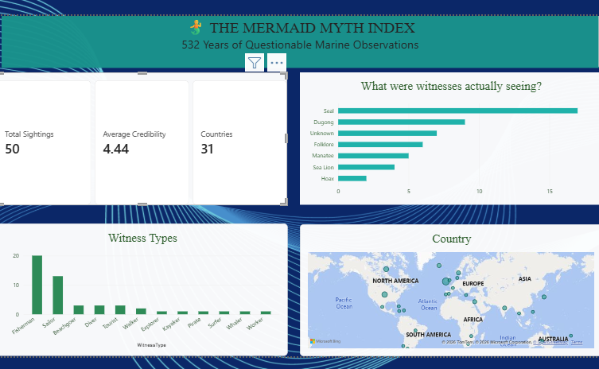

## Projects

### Finance Executive Summary

An interactive Power BI dashboard analysing financial and sales performance.

**Key Features**
- Executive KPI cards
- Monthly profit analysis
- Profit by country
- Sales by product and segment
- Interactive year filtering
- DAX measures
- Business-focused data visualisation

[Download Power BI File](projects/Executive%20Summary%20-Finance%20Report.pbix)

---

### HR Analytics Dashboard

An interactive Power BI dashboard analysing employee demographics, workforce distribution and training compliance.

**Key Features**
- Employee demographics and workforce analysis
- Department and location analysis
- Employee status reporting
- Training compliance monitoring
- DAX measures
- Interactive filtering
- Business-focused data visualisation

[View HR Analytics Project](projects/hr-analytics.md)

[Download Power BI File](projects/HR%20Dashboard.pbix)

---

## About

I am developing my skills in Microsoft data technologies, with a focus on Power BI, DAX, Power Query, data modelling and analytics.

This portfolio documents my progress through practical projects and provides examples of my technical and analytical work.

---

## Premier League Defender Analysis

An interactive Power BI analysis exploring whether expensive Premier League defenders provide stronger defensive performance relative to their market value.

**Key Features**

- Defender market value analysis
- Adjusted defensive performance
- Defensive actions per 100 defensive minutes
- Player-level comparison
- Market value versus defensive performance
- Interactive Power BI visualisation
- DAX measures
- Business-focused analytical thinking

[View Premier League Defender Project](projects/premier-league-defender-analysis.md)

[Download Power BI File](projects/Premier_League_Defender_Analysis.pbix)

---

### Mermaid Myth Index

A light-hearted Power BI project exploring historical folklore and reported mermaid sightings.

This dashboard uses a curated educational dataset inspired by historical folklore and reported mermaid sightings. It is a light-hearted Power BI project intended to demonstrate visualisation and storytelling techniques.

**Key Features**
- KPI cards
- Witness and sighting analysis
- Geographic visualisation
- Interactive Power BI dashboard
- Data storytelling
- Power BI visualisation

[Download Power BI File](projects/Mermaid%20Myths.pbix)
