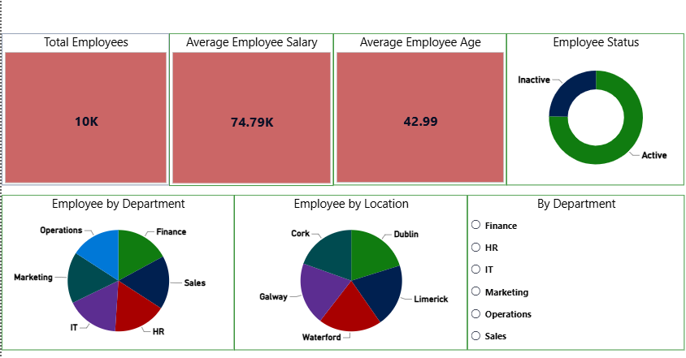
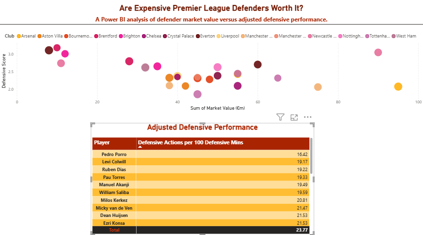
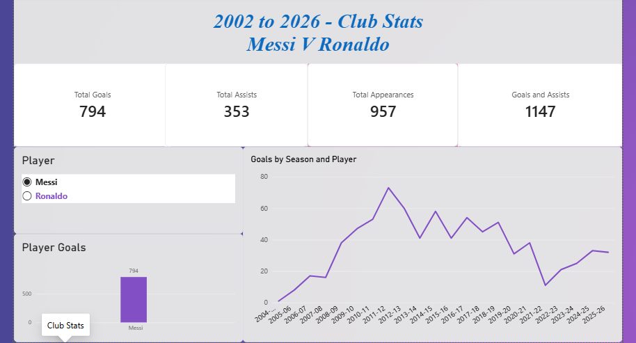
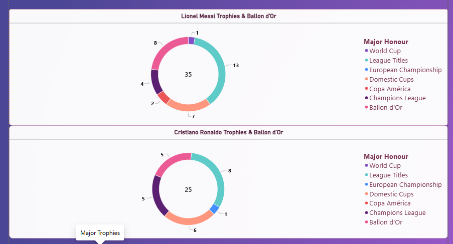
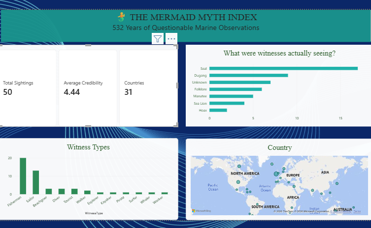
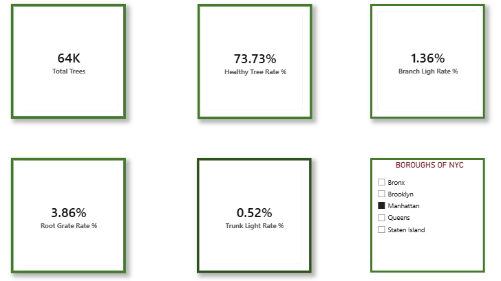
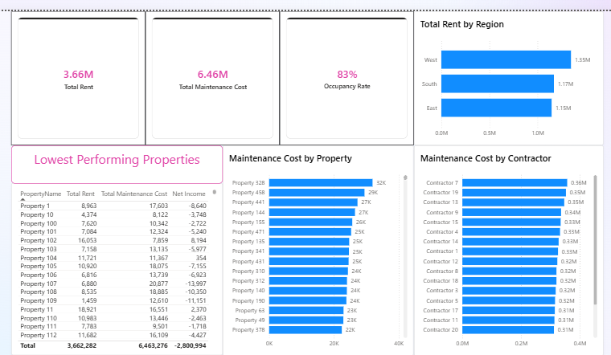

## Projects

### Finance Executive Summary

An interactive Power BI dashboard analysing financial and sales performance.

**Key Features**
- Executive KPI cards
- Monthly profit analysis
- Profit by country
- Sales by product and segment
- Interactive year filtering
- DAX measures
- Business-focused data visualisation

[Download Power BI File](projects/Executive%20Summary%20-Finance%20Report.pbix)

---

### HR Analytics Dashboard

An interactive Power BI dashboard analysing employee demographics, workforce distribution and training compliance.

**Key Features**
- Employee demographics and workforce analysis
- Department and location analysis
- Employee status reporting
- Training compliance monitoring
- DAX measures
- Interactive filtering
- Business-focused data visualisation

[View HR Analytics Project](projects/hr-analytics.md)

[Download Power BI File](projects/HR%20Dashboard.pbix)

---

## About

I am developing my skills in Microsoft data technologies, with a focus on Power BI, DAX, Power Query, data modelling and analytics.

This portfolio documents my progress through practical projects and provides examples of my technical and analytical work.

---

## Premier League Defender Analysis

An interactive Power BI analysis exploring whether expensive Premier League defenders provide stronger defensive performance relative to their market value.

**Key Features**

- Defender market value analysis
- Adjusted defensive performance
- Defensive actions per 100 defensive minutes
- Player-level comparison
- Market value versus defensive performance
- Interactive Power BI visualisation
- DAX measures
- Business-focused analytical thinking

[View Premier League Defender Project](projects/premier-league-defender-analysis.md)

[Download Power BI File](projects/Premier_League_Defender_Analysis.pbix)

---

### Messi vs Ronaldo — Career Comparison

A Power BI comparison of Lionel Messi and Cristiano Ronaldo, focusing on club attacking statistics and major career honours from 2002–2026.

**Key Features**

- Goals, assists and appearances comparison
- Goals + assists measurement
- Goals by season analysis
- Major trophy comparison
- Ballon d'Or comparison
- Interactive player selection
- Power BI data visualisation

[Download Power BI File](RonvMes.pbix)

---

### Mermaid Myth Index

A light-hearted Power BI project exploring historical folklore and reported mermaid sightings.

This dashboard uses a curated educational dataset inspired by historical folklore and reported mermaid sightings. It is a light-hearted Power BI project intended to demonstrate visualisation and storytelling techniques.

**Key Features**
- KPI cards
- Witness and sighting analysis
- Geographic visualisation
- Interactive Power BI dashboard
- Data storytelling
- Power BI visualisation

[Download Power BI File](projects/Mermaid%20Myths.pbix)

---

### NYC Tree Census Analysis

A Power BI analysis of the 2015 NYC Tree Census, exploring recorded tree problems, problem drivers, tree types, borough-level patterns and stewardship.

**Key Questions**

- Do trees with stewardship have fewer recorded problems?
- Which tree types have the highest recorded problem rates?
- What are the most common recorded problems?
- Which boroughs have the most recorded problems?
- What problem types are most common across boroughs?
- What factors appear to be associated with specific tree problems?

**Key Features**

- Problem rate analysis
- Tree type analysis
- Problem driver analysis
- Tree health analysis
- Borough-level analysis
- Stewardship analysis
- DAX measures
- Real-world public dataset

---

# Emerald Property Management — Power BI Analysis

A Power BI analysis of a property management portfolio, examining rental income, maintenance expenditure, occupancy and profitability across properties, contractors and regions.

## Business Questions

- Is the property portfolio generating positive net income?
- How do rental income and maintenance expenditure compare?
- Are financial losses concentrated in particular properties, property types, contractors or regions?
- What patterns can be identified across the portfolio?

## Key Findings

- **Rental income:** Approximately £3.66 million.
- **Maintenance costs:** Approximately £6.46 million.
- **Net income:** Approximately -£2.80 million.
- **Occupancy rate:** 83%.
- Negative net income appears across multiple property types and regions, rather than being confined to one obvious outlier.

The analysis suggests that maintenance expenditure is a major contributor to the portfolio's negative financial result.

## Analysis and Features

- Portfolio performance overview
- Profitability analysis
- Net income by property type and region
- Maintenance costs by property
- Maintenance costs by contractor
- Occupancy and maintenance metrics
- DAX measures and Power BI visualisation
- Business-focused findings and recommendations

## Conclusion and Limitations

The portfolio records substantially higher maintenance costs than rental income. The pattern occurs across multiple properties and regions, suggesting that the issue warrants broader investigation rather than attention to a single property or contractor.

The available data does not establish the underlying causes. Further information, such as maintenance work orders, repair categories, lease details, property condition and contractual arrangements, would be required to investigate the drivers of expenditure and identify appropriate actions.

The findings are therefore limited to the data supplied.

## Tools and Skills

- Microsoft Power BI
- DAX
- Data modelling
- Business performance analysis
- Data visualisation
- Evidence-based interpretation and communicating data limitations

## Project File

[**Download the Power BI report**](https://github.com/JKD321/powerbi-portfolio/releases/tag/property-v1.0)

*This project forms part of an ongoing Power BI portfolio, with a developing focus on property performance and analytics.*
