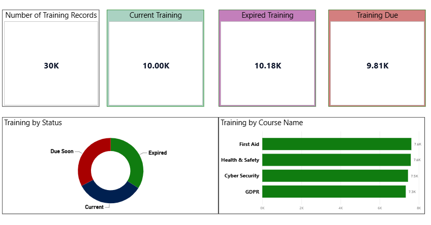

# HR Analytics Dashboard

## Overview

This project is an interactive HR analytics dashboard built in Microsoft Power BI.

The report is designed to provide an overview of employee demographics, workforce distribution and training compliance.

## Dashboard Pages

### Employee Dashboard

The Employee Dashboard provides an overview of the workforce, including:

- Total employees
- Average employee salary
- Average employee age
- Employee status
- Employees by department
- Employees by location

### Training Compliance

The Training Compliance dashboard analyses employee training records and provides visibility of:

- Total training records
- Current training
- Expired training
- Training due
- Training status
- Training by course

## Power BI Skills Demonstrated

- Data preparation
- Power Query
- Data modelling
- DAX measures
- KPI cards
- Interactive filtering
- Data visualisation
- Dashboard design
- Business-focused reporting

## Key Insights

The dashboard provides a high-level view of workforce composition and highlights the current state of employee training compliance.

The training analysis can help identify courses requiring attention and employees whose training is approaching or has passed its expiry date.

## Future Improvements

As my Power BI skills develop, I plan to enhance this project with:

- More advanced DAX measures
- Time-based analysis
- Additional HR KPIs
- Improved data modelling
- More advanced interactive features
- Additional business insights

## Tools Used

- Microsoft Power BI
- Power Query
- DAX
