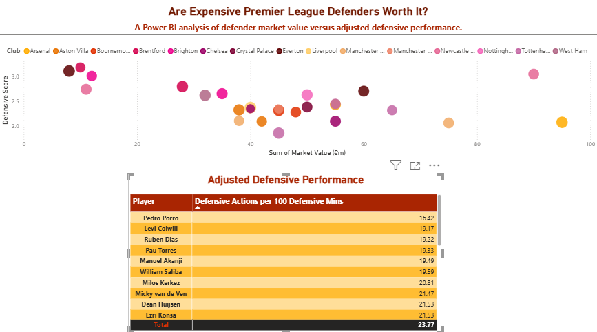

# Premier League Defender Analysis

## Overview

This project is a Power BI analysis exploring whether expensive Premier League defenders provide stronger defensive performance relative to their market value.

The dashboard compares player market value with adjusted defensive performance to identify patterns and highlight potentially undervalued or overvalued players.

## Dashboard

()

## Analysis

The dashboard includes:

- Defender market value analysis
- Adjusted defensive performance
- Defensive actions per 100 defensive minutes
- Player-level comparison
- Market value versus defensive performance
- Interactive Power BI visualisation

## Key Question

**Are expensive Premier League defenders worth the investment?**

The analysis looks beyond market value alone by comparing player cost with defensive output.

## Power BI Skills Demonstrated

- Data preparation
- Power Query
- Data modelling
- DAX measures
- Calculated measures
- Data visualisation
- Scatter plot analysis
- Player-level analysis
- Business-focused analytical thinking

## Key Insight

The analysis demonstrates that higher market value does not necessarily correspond directly to stronger defensive performance.

Comparing cost against output can provide a more useful view of player value than looking at market value alone.

## Future Improvements

As my Power BI skills develop, I plan to enhance this project with:

- Additional defensive metrics
- More advanced DAX measures
- Position-based comparisons
- Club-level analysis
- Time-based analysis
- Improved player value calculations
- Additional interactive filtering

## Tools Used

- Microsoft Power BI
- Power Query
- DAX
- Data Visualisation
